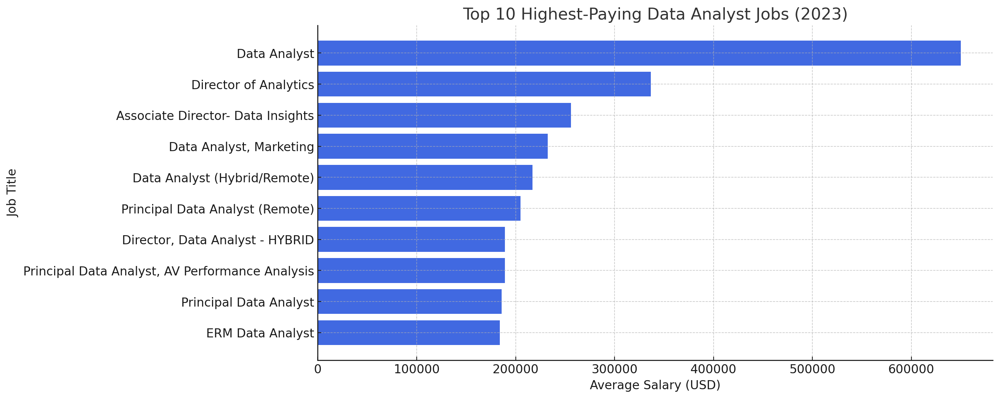

# Introduction
💼 Dive into the data job market! Focusing on data analyst roles, this project explores 💰 top-paying jobs, 🔥 in-demand skills, and ☑️ where high demand meets high salary in data analytics.

🔍 SQL queries? Check them out here: [project_sql folder](/project_sql/).

# Background
Driven by a quest to navigate the data analyst job market more effectively, this project was born from a desire to pinpoint top-paid and in-demand skills, streamlining others' work to find optimal jobs.  

Data is from [SQL Course](https://lukebarousse.com/sql). It's packed with insights on job titles, salaries, locations, and essential skills.

### The questions I wanted to answer through this SQL queries were:

1. What are the top-paying data analyst jobs?  
2. What skills are required for these top-paying jobs?  
3. What skills are most in demand for data analysts?  
4. Which skills are associated with higher salaries?  
5. What are the most optimal skills to learn?  

# Tools I Used 
For my deep dive into the data analyst job market, I harnessed the power of several key tools:  

- **SQL**: The backbone of my analysis, allowing me to query the database and unearth critical insights.  
- **PostgreSQL**: The chosen database management system, ideal for handling the job posting data.  
- **Visual Studio Code**: My go-to for database management and executing SQL queries.  
- **Git & GitHub**: Essential for version control and sharing my SQL scripts and analysis, ensuring collaboration and project tracking.  

# The Analysis 
Each query for this project aimed at investigating specific aspects of the data analyst job market.  
Here's how I approached each question:  

### 1. Top Paying Data Analyst Jobs  
To identify the highest-paying roles, I filtered data analyst positions by average yearly salary and location, focusing on remote jobs. This query highlights the high-paying opportunities in the field. 
```sql
SELECT
    jpf.job_id,
    cd.name AS company_name,
    jpf.job_title,
    jpf.job_location,
    jpf.job_schedule_type,
    jpf.salary_year_avg,
    jpf.job_posted_date
FROM
    job_postings_fact jpf
    LEFT JOIN company_dim cd ON cd.company_id = jpf.company_id
WHERE
    job_title_short = 'Data Analyst'
    AND job_work_from_home = TRUE
    AND salary_year_avg IS NOT NULL
ORDER BY
    salary_year_avg DESC
LIMIT
    10;
```

Here's the breakdown of the top data analyst jobs in 2023: 
- **Wide Salary Range:** Top 10 paying data analyst roles span from $184,000 to $650,000, indicating significant salary potential in the field.  
- **Diverse Employers:** Companies like SmartAsset, Meta, and AT&T are among those offering high salaries, showing a broad interest across different industries.  
- **Job Title Variety:** There's a high diversity in job titles, from Data Analyst to Director of Analytics, reflecting varied roles and specializations within data analytics.  


*Bar graph visualizing the salary for the top 10 salaries for data analysts; ChatGPT generated this graph from my SQL query results*
  
# What I learned
Throughout this adventure, I’ve learned SQL toolkit with some serious firepower:  

- **⚡ Complex Query Crafting:** Mastered advanced SQL, seamlessly merging tables and wielding `WITH` clauses for efficient temp table maneuvers.  
- **📊 Data Aggregation:** Leveraged `GROUP BY`, `COUNT()`, and `AVG()` to transform raw data into meaningful insights.  
- **🧠 Analytical Wizardry:** Enhanced my real-world problem-solving skills, converting complex questions into actionable SQL queries.

# Conclusions
### 📊 Insights  
1. **💰 Top-Paying Data Analyst Jobs:** The highest-paying jobs for data analysts that allow remote work offer a wide range of salaries, the highest reaching $650,000!  
2. **🛠 Skills for Top-Paying Jobs:** High-paying data analyst jobs require advanced proficiency in SQL, suggesting it's a critical skill for earning a top salary.  
3. **🔥 Most In-Demand Skill:** SQL is the most demanded skill in the data analyst job market, making it essential for job seekers.  
4. **📈 Skills with Higher Salaries:** Specialized skills, such as SVN and Solidity, are associated with the highest average salaries, indicating a premium on niche expertise.  
5. **🎯 Optimal Skills for Job Market Value:** SQL ranks as one of the most optimal skills for data analysts to learn to maximize their market value.

### 🔍 Closing Thoughts  

This project enhanced my SQL skills and provided valuable insights into the data analyst job market. The findings from the analysis serve as a guide for prioritizing skill development and job search efforts.  
Aspiring data analysts can better position themselves in a competitive job market by focusing on high-demand, high-salary skills. This exploration highlights the importance of continuous learning and adaptation to emerging trends in the field of data analytics.
